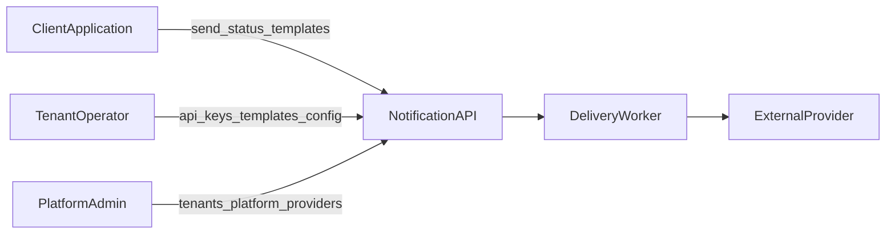
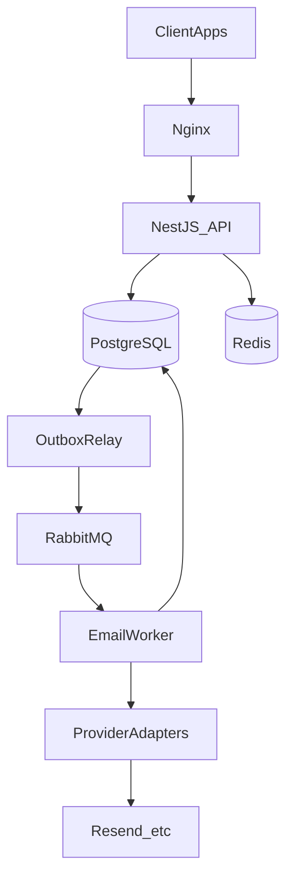

# System Architecture

## Product intent

External applications call a simple HTTP API to send transactional notifications. They must not need to know which provider sends the message, how retries work, how queues work, how templates are rendered, or how delivery attempts are recorded.

Those concerns belong to this platform.

## First principles

**Problem:** Clients need reliable multi-channel notify without owning provider ops.

**Simplest option:** HTTP handler calls the provider synchronously and returns the result.

**Why we reject that:** Provider timeouts, traffic spikes, and process crashes cause lost or duplicated sends. The API becomes coupled to the slowest external network call.

**Choice:** Accept the intent in a database transaction, publish via a transactional outbox, dispatch asynchronously over RabbitMQ, and send from dedicated workers through provider adapters.

See also:

- [ADR-003 Transactional Outbox](./adr/0003-transactional-outbox.md)
- [ADR-004 At-Least-Once Delivery](./adr/0004-at-least-once-delivery.md)
- [ADR-007 Modular Monolith + Workers](./adr/0007-modular-monolith-workers.md)

## Actors

| Actor | Responsibilities |
|-------|------------------|
| Client application | Send notifications, poll status, manage templates, rotate API keys |
| Tenant operator | Configure templates and inspect usage/failures (API-first in MVP) |
| Platform admin | Provision tenants, platform default providers, operations |
| Delivery worker | Consume queues, render templates, call providers, record attempts |
| External provider | Accept send requests (Resend initially; SMS/push later) |



## Container view



### Processes (one codebase, two entrypoints)

| Process | Entrypoint | Role |
|---------|------------|------|
| API | `node dist/main.js` | HTTP, auth, validation, accept path, outbox relay (initially) |
| Worker | `node dist/worker.js` | RabbitMQ consumers, template render, provider dispatch |

Do **not** split into separate microservices or repos for MVP. Split **processes**, share **domain modules**. See [ADR-007](./adr/0007-modular-monolith-workers.md).

### Outbox relay placement

The outbox relay runs inside the API process initially (scheduled poll of pending outbox rows).

If API restarts starve publishing under load, extract a tiny third process. Do that only when measured, not by default.

## Accept path (happy path)

```text
Client
  → Nginx
  → API (auth, rate limit, validate, idempotency)
  → PostgreSQL TX: Notification + OutboxMessage (+ IdempotencyRecord)
  → 202 Accepted
  → Outbox relay publishes to RabbitMQ (publisher confirms)
  → Notification status: accepted → queued
  → Email worker consumes, claims row, renders template, calls provider
  → NotificationAttempt recorded
  → Notification status: … → sent | failed | dead_lettered
```

Postgres is the system of record. RabbitMQ carries **references** (IDs), not the full payload. See [ADR-010](./adr/0010-message-ids-only.md) and [rabbitmq.md](./rabbitmq.md).

## Consistency model

| Concern | Consistency |
|---------|-------------|
| Accept + idempotency | Strong (PostgreSQL transaction) |
| “Sent” visible to client | Eventual (after worker completes) |
| Broker vs DB | Outbox makes “accepted ⇒ eventually published” reliable |

## Multi-tenancy

Shared database, `tenant_id` on every tenant-owned row. Not schema-per-tenant at this scale.

Every repository query must filter by `tenantId` from auth context. Never trust a client-supplied tenant id.

Details: [domain.md](./domain.md), [ADR-006](./adr/0006-multi-tenancy.md).

## Provider abstraction

Business logic depends on channel ports (e.g. `EmailProvider`), not on Resend/SendGrid/SES/Twilio SDKs.

Vendor SDKs live only under `infrastructure/provider-adapters`.

MVP: one email adapter (Resend). Failover chains are **out of MVP** — provider timeouts are ambiguous and can double-send. See [ADR-005](./adr/0005-provider-abstraction.md).

## Rate limiting

Redis **token bucket**, keyed by tenant (channel limits later). See [ADR-009](./adr/0009-redis-token-bucket.md).

## Contract-based implementation

All boundaries are **contract-first**: HTTP DTOs + OpenAPI, domain port interfaces, typed queue messages, and contract-tested provider adapters. Domain code never depends on vendor SDKs.

Details: [contracts.md](./contracts.md), [ADR-011](./adr/0011-contract-based-implementation.md).

## Deployment (initial VPS)

```text
Internet
   |
 Nginx (host — not in Compose)
   |
  API (Compose)
   |
-------------------------
|           |           |
Postgres   Redis     RabbitMQ
(Compose) (Compose) (Compose)
                         |
                       Worker (Compose)
```

**Nginx** terminates TLS and reverse-proxies to the API on the server (e.g. `127.0.0.1:3000`). Reference config: [`deploy/nginx/`](../deploy/nginx/README.md).

Everything else runs via Docker Compose initially. Domain code must not assume Kubernetes. Cloud/K8s is a later ops move, not a rewrite of the domain.

## Scale path

| Scale | What changes |
|-------|----------------|
| 1–10 tenants, 10k–100k/day | Single VPS Compose; 1 API + 1 worker |
| Toward ~1M/day | More worker replicas; tune prefetch; possibly separate outbox relay process; vertical DB/RMQ |
| 100+ tenants, multi-million/day | Partitioning/sharding strategies, CDC outbox consideration, dedicated broker cluster, per-channel autoscaling — **not** day-one microservices |

Avoid premature microservices. The modular monolith + workers model is intentional.

## Target project structure

```text
src/
  main.ts
  worker.ts
  contracts/           # API DTOs, domain ports, message types (contract-first)
    api/
    domain/
    messaging/
  modules/
    identity/
    notifications/
    templates/
    providers/
    outbox/
    rate-limits/
  infrastructure/
    database/            # TypeORM DataSource, migrations
    rabbitmq/
    redis/
    provider-adapters/
  common/
  config/
docs/
  adr/
```

## Related docs

- [Domain model](./domain.md)
- [Notification lifecycle](./notification-lifecycle.md)
- [RabbitMQ](./rabbitmq.md)
- [Failure modes](./failure-modes.md)
- [MVP scope](./mvp-scope.md)
- [Roadmap](./roadmap.md)
