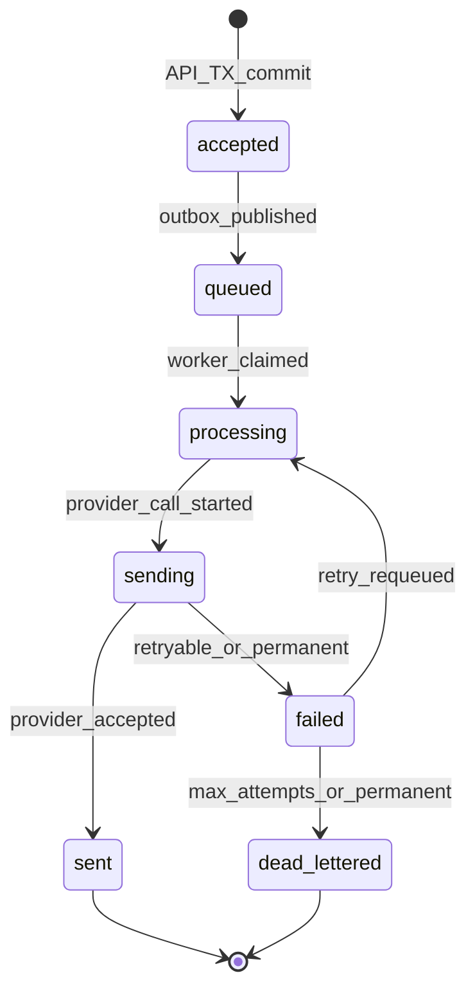

# Notification Lifecycle

Statuses are enforced by domain logic. Arbitrary transitions are forbidden.

## State machine

## Status definitions

| Status | Meaning |
|--------|---------|
| `accepted` | Persisted in Postgres inside the accept transaction; not yet confirmed in RabbitMQ |
| `queued` | Outbox relay published to the broker (publisher confirm succeeded) |
| `processing` | A worker claimed the notification row |
| `sending` | Provider call in flight for the current attempt |
| `sent` | Provider accepted the message (terminal success for MVP) |
| `failed` | Last attempt failed; may retry if policy allows |
| `dead_lettered` | Permanent failure or max attempts exhausted (terminal) |

## Allowed transitions

| From | To |
|------|----|
| `accepted` | `queued` |
| `queued` | `processing` |
| `processing` | `sending` |
| `sending` | `sent`, `failed` |
| `failed` | `processing`, `dead_lettered` |

Any other transition must throw a domain error.

## Design notes

### No stored `RETRYING` status

Retries are modeled as:

- status stays / returns to `failed` with `next_attempt_at`, and/or
- message placed on a TTL retry queue

Avoid status chatter that does not change client-visible semantics.

### `queued` is not a delivery promise

`queued` means the broker has a message referencing this notification. Delivery still depends on workers and providers.

### Terminal states

- Success: `sent`
- Failure: `dead_lettered`

Clients may poll until a terminal state. Webhooks (later) will emit on these transitions.

### Attempt numbering

Each provider call creates a `NotificationAttempt` with monotonic `attempt_no`. The notification status machine and attempt history must stay consistent inside worker transactions.

### Claiming

Workers claim with an optimistic condition, e.g. update where `status = queued` (or `failed` ready for retry) and version matches. Losers of the race must not send.

## Client-visible mapping (API)

The public API may expose the same statuses or a slightly coarser view. Do not allow clients to PATCH status.
